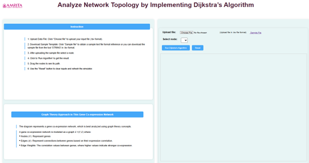
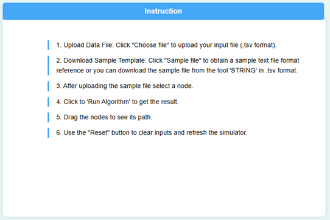
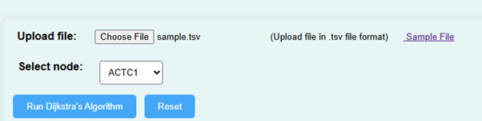
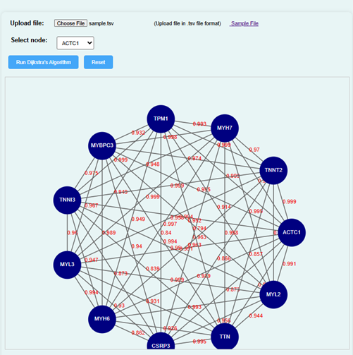
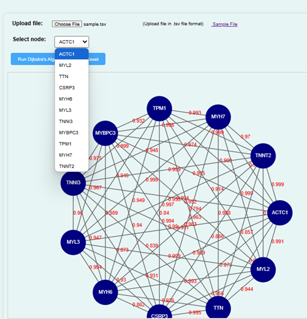
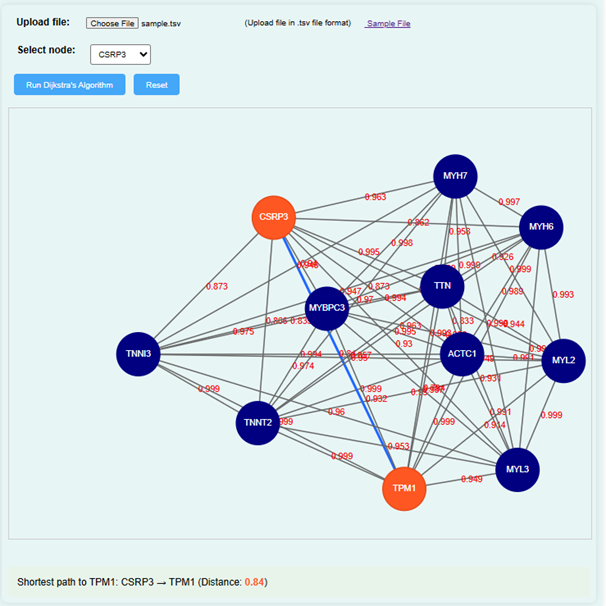
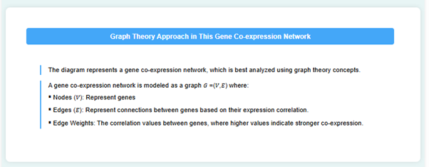
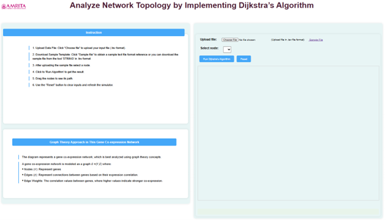

### Procedure

1. Open the simulator tab where user can find a user-friendly interface with different options to run the experiment. 

&nbsp;

2. Instructions to perform the simulator were provided in the page. Read through the guidelines to understand how the simulator works before proceeding. 

&nbsp;

3. To begin the experiment, upload a gene expression dataset in .tsv file format. Alternatively, download a sample file from the page and upload it using the “Choose File” button. 

&nbsp;

4. Click on the “Run Dijkstra’s Algorithm”. This will analyse the network topology of gene interactions.

&nbsp;

5. The simulator displays a network of nodes representing genes. Choose a node to analyse the shortest path between gene interactions.

&nbsp;

6. Suppose the user select CSRP3 as a node and run Dijkstra’s algorithm will get a result diagram as shown below. If the user wants to find the shortest distance between CSRP3 and TPM1, click on these genes in the simulator.

&nbsp;

7. The simulator will calculate the shortest distance between the selected genes and display the result on the screen. For example, if the distance between CSRP3 and TPM1 is 0.84, it will be shown in the GUI.

&nbsp;

8. On the left side of the interface, user can also find the explanations of parameters and diagrams to help to understand the network topology.

&nbsp;

9. User can repeat the experiment, click on the “Reset” button to clear the current data and start again.

&nbsp;
