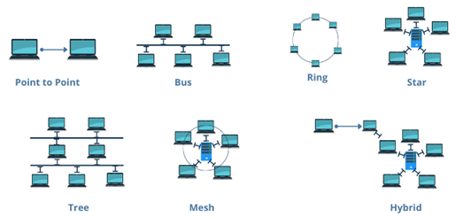
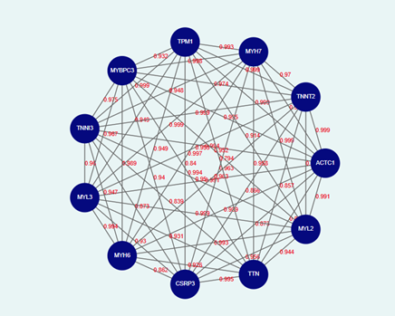

### Introduction

In today's advancing field of neuroscience and artificial intelligence, network topology plays a fundamental role in determining how information is transmitted, processed, and learned. Network topology describes the structural arrangement of interconnected entities such as neural pathways in the brain, ecological food webs, or molecular interaction networks. Learning the network topology allows the researchers to analyse complex systems, optimize resource flow, and improve the resilience of biological, physical, and computational networks. In case of human brain, neurons form complex networks where their connections, or synapses, define the flow of electrical and chemical signals. Neural network topology, which defines the structural arrangement of neurons and their connections, directly influences information processing, learning efficiency, and overall system performance. The topology of these neural connections influences cognitive functions such as perception, memory, and decision-making. Similarly, in artificial neural networks (ANNs), the arrangement of layers and neurons dictates the efficiency of learning and pattern recognition. By studying network topology, scientists can better understand how neurons communicate, leading to advancements in neuroscience, brain-computer interfaces, and deep learning architectures. Understanding these connections also helps in optimizing computational models that mimic human intelligence, paving the way for more efficient AI systems.

As the complexity of networks increases, analysing and optimizing the structure becomes essential for maintaining efficient functionality. Graph-based algorithms, particularly shortest path algorithms, play a crucial role in evaluating network efficiency by identifying the most optimal routes between interconnected nodes. The algorithms, such as Dijkstra’s Algorithm, provide a systematic approach to minimizing travel time, reducing communication delays, and optimizing resource distribution in various networked systems, from neural pathways in the brain to large-scale transportation and telecommunication networks. Understanding Dijkstra’s Algorithm in the context of network topology equips students and professionals with the ability to model, analyse, and optimize real-world networks. Given the increasing reliance on intelligent systems, IoT (Internet of Things), and smart cities, mastering this algorithm is highly relevant in today’s technological landscape. By learning Dijkstra’s Algorithm and its applications in network topology, students can gain essential problem-solving skills that are crucial for tackling modern engineering and scientific challenges.

### Understanding Network Topology
Network topology refers to the arrangement of nodes (such as computers, routers, or devices) and connections (such as cables or wireless links) in a network. It defines how data flows between nodes and plays a crucial role in determining the efficiency, scalability, and reliability of a network.
Network topology is broadly categorized into physical topology, which describes the actual layout of devices and connections, and logical topology, which represents how data moves within the network, regardless of the physical layout. A well-structured network topology ensures optimal communication, minimizes latency, and enhances fault tolerance, making it essential for applications such as internet communication, electrical power distribution, and even biological neural networks.

### Types of Network Topology
Different types of network topologies (Fig.1) serve distinct purposes based on their structure and efficiency.

#### 1.Point to Point Topology: 
Point-to-point topology is a type of topology that works on the functionality of the sender and receiver. It is the simplest communication between two nodes, in which one is the sender, and the other one is the receiver. Point-to-Point provides high bandwidth.

#### 2.Bus Topology: 
All nodes share a single central communication line (bus). Data travels in both directions along the bus, but if the main cable fails, the entire network may be disrupted. This topology is cost-effective but has limited scalability.

#### 3.Star Topology: 
Every node is connected to a central hub or switch. The hub manages data transmission, ensuring efficient communication. It is highly reliable since individual node failures do not affect the entire network, but failure of the central hub can lead to network breakdown.

#### 4.Tree Topology: 
The nodes are arranged in a hierarchical structure, where each node is connected to a parent node, forming a branching tree-like pattern. Data flows between nodes through this structured hierarchy, ensuring efficient communication and organization. This topology is commonly used in large networks due to its scalability, as additional nodes can be easily added without disrupting the existing structure.

#### 5.Ring Topology: 
Nodes are connected in a circular manner, where data travels in one or both directions. While it provides equal data transmission opportunities to all nodes, a single point of failure can disrupt the entire network unless fault-tolerant mechanisms like dual rings are implemented.

#### 6.Mesh Topology: 
Every node is directly connected to multiple other nodes, ensuring high reliability and redundancy. It can be fully connected (where each node connects to every other node) or partially connected (where only some nodes have direct connections). While this topology enhances fault tolerance, it is costly due to the high number of connections required.

#### 7.Hybrid Topology: 
A combination of two or more topologies, offering flexibility and scalability. For example, a tree topology integrates multiple star networks into a hierarchical structure, making it ideal for large-scale enterprise networks.

Fig 1: Different types of Network Topology
Adapted from: https://networksimulationtools.com/network-topology-projects/

&nbsp;

## Dijkstra’s Algorithm in Gene Interactions
In biological systems, genes interact through complex networks, influencing each other's expression and regulating essential cellular processes. These gene interaction networks can be represented as graphs, where genes are nodes and interactions between them are edges with associated weights. The distance between genes in such networks is a crucial factor in understanding gene regulation, as it reflects the strength, probability, or biological significance of their interactions.Calculating gene interaction distances helps in identifying functionally related genes, detecting disease-associated pathways, and optimizing drug targeting strategies. 

Dijkstra's Algorithm, introduced by Edsger Dijkstra in 1956, is a fundamental algorithm used to determine the shortest paths from a single source vertex to all other vertices in a weighted graph. This algorithm operates on the principle of a greedy strategy, continually expanding the set of vertices with known shortest path estimates until all vertices have been processed. Dijkstra’s Algorithm determines the shortest path in a weighted network, can be applied to these gene networks to compute the most efficient regulatory pathways. This is particularly useful in genomics, where understanding the shortest functional route between a mutated gene and its downstream effects can reveal critical disease mechanisms and potential therapeutic targets. By analysing gene interaction distances using Dijkstra’s Algorithm, researchers can uncover key regulatory genes, improve precision medicine approaches, and enhance our understanding of genetic disorders.

### Graph Theory Representation of Gene Interaction Networks
Gene interaction networks can be effectively modelled using graph theory, a mathematical framework that helps represent complex biological relationships in an organized manner. In these networks, genes are represented as nodes (vertices), while interactions between genes—such as activation, inhibition, or co-expression—are represented as edges (connections). By using graph-based approaches, researchers can analyse regulatory relationships, identify key genes in biological pathways, and predict disease-related gene interactions.

### Components of a Gene Interaction Network in Graph Theory
#### 1.	Nodes (Vertices):  
In a gene interaction network, each node represents a gene (Fig.2). These genes can be classified based on their function, such as transcription factors, signalling molecules, or metabolic enzymes. For example, in a cancer-related gene network, nodes might include genes such as TP53 (a tumour suppressor), BRCA1, MYC, and BAX, MDM2(which regulates TP53). Nodes help in visualizing how different genes are functionally linked within a biological system.

#### 2.	Edges (Connections): 
Edges represent functional relationships between genes, which can include activation, inhibition, or co-expression. If one gene regulates another by increasing its expression (activation) or suppressing it (inhibition), this interaction is represented as a directed edge (with an arrow indicating direction). In co-expression networks, genes with similar expression patterns relate to undirected edges. For instance, in a signalling pathway, if TP53 activates BAX (a pro-apoptotic gene), the edge between them would represent activation.

•TP53 → BAX (Activation: TP53 promotes BAX expression, leading to apoptosis).
•TP53 → MDM2 (Inhibition: TP53 suppresses MDM2, which otherwise degrades TP53 itself).

##### •	Types of Edges:
•Activation (→): One gene promotes the expression of another.

•Inhibition (⊣): One gene suppresses the function of another.

•Co-expression (—): Two genes are expressed together in a correlated manner.

#### 3.	Directed vs. Undirected Graphs: 
A directed graph is used when interactions have a direction (e.g., Gene A activates Gene B but not vice versa). An undirected graph is used when interactions are mutual (e.g., genes that co-express together without a known directional effect).

•Directed: TP53 → BAX (TP53 regulates BAX, but not the other way around).

•Undirected: PPI networks where proteins bind but do not regulate each other.

#### 4.	Edge Weights: 
Edges are assigned weights, which represent the strength, probability, or biological significance of the interaction. These weights can be derived from gene expression data, protein-protein interaction scores, or other biological measurements. For example, in a regulatory network, the weight between TP53 and BAX could be based on the strength of activation observed in experimental data. A higher weight may indicate a stronger regulatory effect, while a lower weight could suggest a weaker or indirect interaction.

•TP53 → BAX (weight = 0.8): Strong activation of BAX by TP53.

•TP53 ⊣ MDM2 (weight = 0.6): Moderate inhibition of MDM2 by TP53.

•BAX → CASP3 (weight = 0.9): High activation of CASP3 by BAX.

Fig.2: Representation of gene interaction network using Graph theory

&nbsp;

Gene interaction networks provide a structured way to analyze complex biological processes, and graph theory offers a mathematical foundation to study these interactions. By representing genes as nodes and their relationships as edges, researchers can visualize how genes regulate each other, predict functional pathways, and identify critical genetic components in diseases. The incorporation of Dijkstra’s Algorithm further enhances this analysis by enabling the identification of the shortest and most efficient regulatory pathways, which is crucial in understanding gene signaling cascades, metabolic pathways, and transcriptional regulation. This approach helps in pinpointing key regulatory genes that influence cellular functions, enabling targeted genetic interventions and advancing precision medicine.

The applications of gene interaction network analysis extend across various fields, including genomics, disease research, and drug discovery. In cancer research, for instance, shortest path algorithms help identify oncogenes and tumour suppressors, aiding in the development of targeted therapies. In pharmacogenomics, gene interaction networks assist in predicting drug responses by analyzing how genetic variations influence drug metabolism. Moreover, in systems biology, these network-based approaches facilitate the modelling of cellular responses to environmental changes, allowing scientists to understand disease mechanisms at a systems level. By integrating graph-based computational techniques into genomic research, we can accelerate the discovery of novel therapeutic strategies and deepen our understanding of the intricate biological networks governing life processes.
